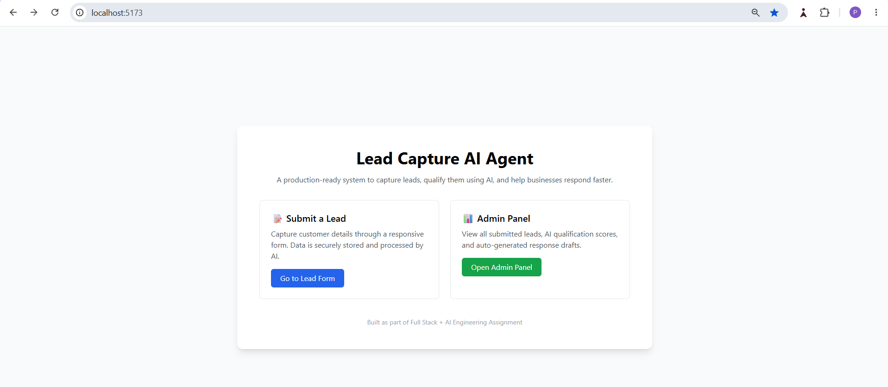
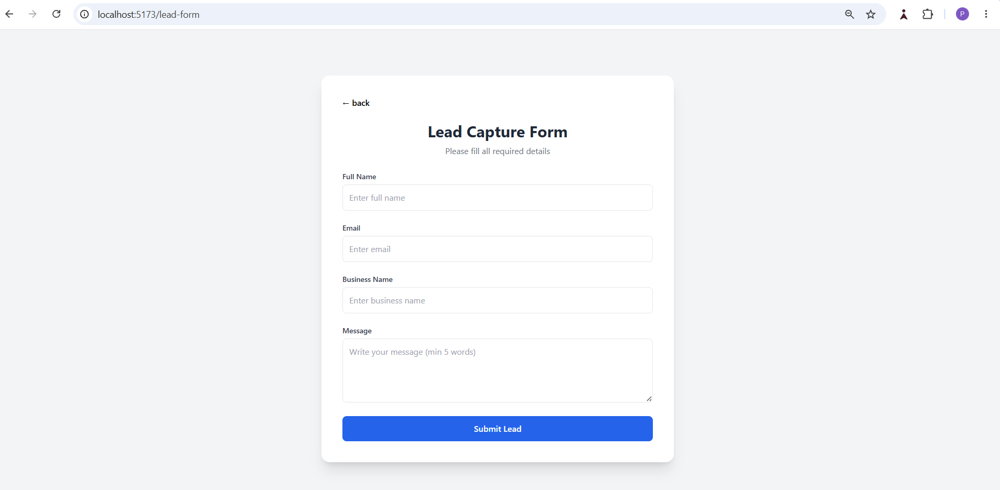
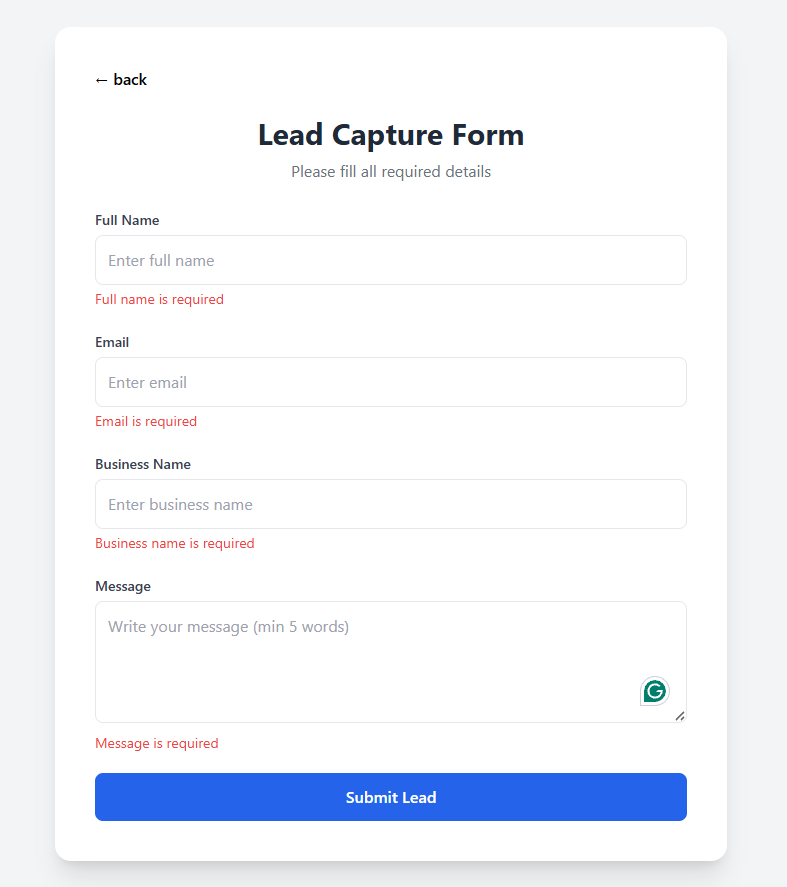
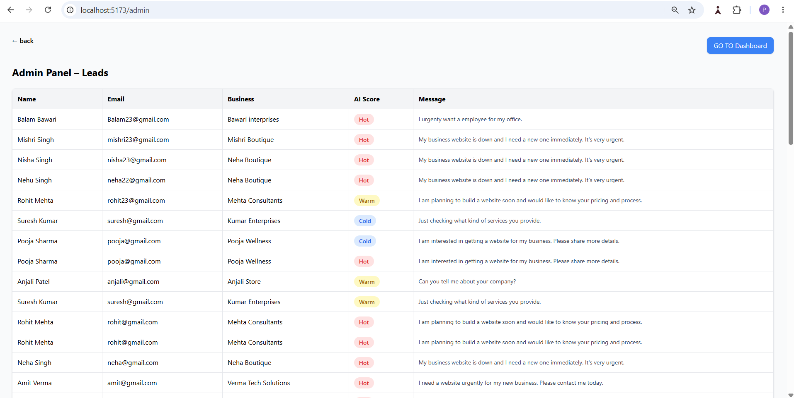
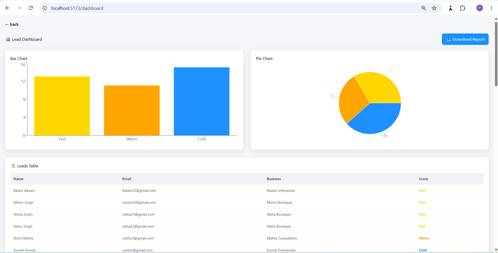

# Lead Capture AI Agent

## Introduction

The project is developed as part of the Engineering Assignment provided by the **OPLIFY SOLUTIONS PVT. LTD.**

The project provide real world solution for the lead generation and track it till its fullfilment to provide end customer a smooth onboarding. This is a inital generic draft of the web application project which can can be enhanced in future based on the business domain specification and requirements.

## Key Features

- Lead Capture Form
- Admin Panel
- AI agent
- Advance Dashboard

## Tech stack

- **Frontend:** React.js
- **Backend:** Node.js, express.js
- **Database:** PostgreSQL 13
- **AI Agent:** OpenRouter
- **CSS:** Talwind CSS
- **Repository:** GitHub

## Environment variables

Database connection config to be stored in .env file
PORT=5000
DB_USER=<DB_USER>
DB_PASSWORD=<DB_PWD>
DB_HOST=localhost
DB_NAME=lead_capture
DB_PORT=5432

AI agent key config to be stored in .env file
OPENROUTER_API_KEY=<API KEY>

## Steps

1. Click or paste the [URL](http://localhost:5173/) in browser to open the application.
   
2. You will be navigated to the landing page with two options

   ### 2.1. Submit a Lead:

   (a) Click on the "Go to Lead Form" button to navigate to the Lead Capture Form.
   

   (b) The form have the fileds like Full Name, Email, Business Name and Message.

   (c) Validation are applied to each filed to capture the all required data.
   

   (d) Once you click the Submit Lead button the data will be submitted to the backend system.

   ### 2.2. Admin Panel:

   (a) On clicking to the "Admin Panel" button will navigate to the "Admin Panel – Leads" dashboard.
   

   (b) The dashboard has the table with all the leads data with an AI agent score and message that helps the admin to pick the leads for further action.

   ### 2.3. Advance Admin Panel:

   (a) On the top left of the "Admin Panel – Leads" dashboard, user will find the "GO TO Dashboard" button.

   (b) On clicking this button user will get navigated to the Advance dashboard.

   (c) This dasboard contains the Pie Chart, Bar Chart with the Leads table.
   

   (d) Advance dashbaord helpn the admin user to track the each day leads with the hot, cold and ward score.

   (e) On the top rigt user can find "Download Report" button that can help user to download the leads_report.csv file in local machine.

## AI tools I used and how

I used **OpenRouter AI** to integrate AI capabilities into this project.

OpenRouter acts as a unified API gateway that provides access to multiple AI models (such as OpenAI, Meta, Google, etc.) using a single API key. This helped me avoid individual billing and setup issues for different AI providers.

For this project, I used the following model via OpenRouter:

- **Model:** openai/gpt-3.5-turbo
- **Purpose:** Lead qualification and response generation

### How it works:

- When a new lead is created, the backend sends lead details (name, email, business name, and message) to OpenRouter.
- The AI analyzes the intent of the lead.
- Based on the intent it returns:
  - Lead score (Hot / Warm / Cold)
  - Reason for the score
  - A short professional email reply
- This data is safely parsed and stored/displayed without crashing the application.

The API key is securely stored in the '.env' file and never hard-coded in the source code.

## My AI orchestration decisions

I designed the AI orchestration with reliability, cost-effectiveness, and simplicity in mind. my orchestration approach focuses on robustness, scalability, and clean separation of concerns, making the AI integration production-ready.

### Key decisions points:

**(a) Centralized AI service:**  
 All AI-related logic is handled inside a dedicated `aiService.js` file. This keeps the code clean and makes future model changes easy.

**(b) Low temperature setting (0.3):**  
 This ensures consistent and predictable responses, which is important for business lead evaluation.

**(c) Strict JSON-only response format:**  
 The prompt forces the AI to return only valid JSON, making it safe to parse and integrate into the backend logic.

**(d) Fallback mechanism:**  
 If the AI service fails or returns an invalid response, the system uses a fallback response instead of crashing. This ensures the application is always stable.

**(e) Model choice:**  
 I selected `openai/gpt-3.5-turbo` via OpenRouter because:

- It is reliable and fast
- It works well on free tiers
- It produces structured, business-friendly resp

### Project Demo

Loom screen recording video
[Project Demo URL](https://www.loom.com/share/92be09466ddc47cc8154fe203f0dc6b4)
